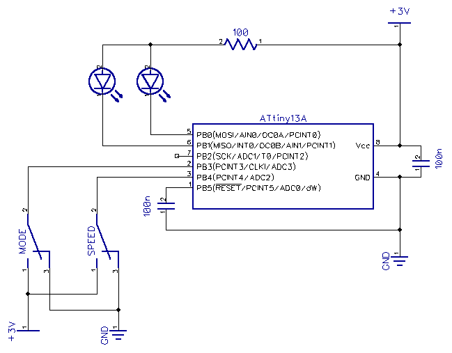

candle
======

Animated LED candle

Uses two LEDs to achieve more realistic look than traditional single LED candles.
The movement vectors (flame position and flame power) are generated with pseudorandom generator and bandpass filters which gives a kind of random oscillation.

Video:
https://www.youtube.com/watch?v=po6SjSLbFRk

